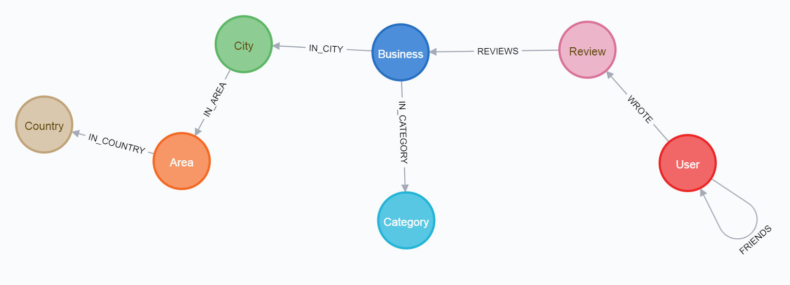

# YelpDataset2Neo4j
Yelp Dataset is imported into Neo4j Graph Database. My blog article: https://medium.com/@thachngoctran/exploring-yelp-dataset-with-neo4j-part-i-from-raw-data-to-nodes-and-relationships-with-python-21f52dd408ef

*Updated on 28.05.2020*: Support Neo4j v4.0.4 and py2neo v5.0b1.

## Raw Data

+ Yelp Dataset: https://www.yelp.com/dataset
  + yelp_academic_dataset_business.json: 145.8 MB
  + yelp_academic_dataset_checkin.json: 428.8 MB => **ignored**.
  + yelp_academic_dataset_review.json: 5.8 GB
  + yelp_academic_dataset_tip.json: 251.2 MB => **ignored**.
  + yelp_academic_dataset_user.json: 3 GB

**Note**: the 3 files should be put into `.\data` folder of the Jupyter Notebook.

+ Some statistics:
   + Number of nodes: **10201067**
   + Number of relationships: **26645898**

Those statistics can be fetched via cypher `CALL apoc.meta.stats()`. They can be cross-checked by counting the numbers of lines in, e.g. `relationships.csv`, `business_nodes.csv`. See the Notebook for further info on such files.

## Intention

Inspired by the book *Graph Algorithms - Practical Examples in Apache Spark & Neo4J (05-2019, Mark Needham, Amy E. Hodler)*, Chapter 7 - *Graph Algorithms in Practice*.

The code of transforming raw data into necessary files, then importing into Neo4j is completely written by me.

After the data ends up as a graph in Neo4j, some Graph Algorithms will be tried out.

Note: Since Neo4j v4.0,, it is advised that **Graph Data Science Library** be used, rather than **Graph Algorithms library**.

## Graph Schema

From Neo4j's Browser, with command `CALL db.schema.visualization()`.

## Development Environment

+ Windows 8.1 x64.
+ Anaconda3-2020.02 x64 (Python v3.7.6).
+ Neo4j v4.0.4 (JDK v11.0.7 LTS x64), with `dbms.memory.heap.max_size` 4GB.
+ Yelp Dataset (03.05.2020). MD5 (yelp_dataset.tar): `7610af013edf610706021697190dab15`.
+ The Neo4j's Database should be a Windows Service. The Neo4j Desktop and Neo4j Python Driver (`py2neo`) connect to it through url `bolt://localhost:7687` with username/password as `neo4j`/`12345`.
+ On Windows, users need sufficient privileges to start/stop/install Services. A UAC dialog may appear, asking for permission.
+ Additional 3rd party Python libraries: `neo4j-driver`, `py2neo` (v5.0b1), `regex`, `reverse_geocoder`.

## License

MIT License
